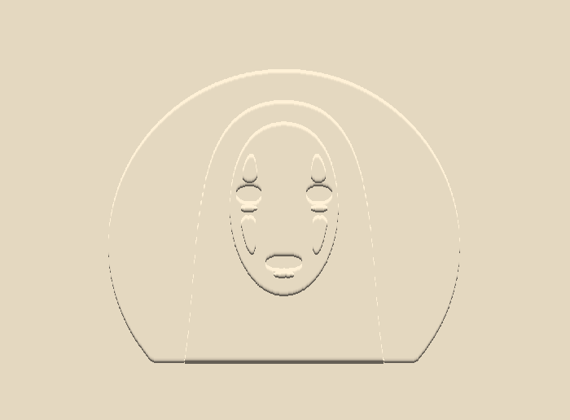
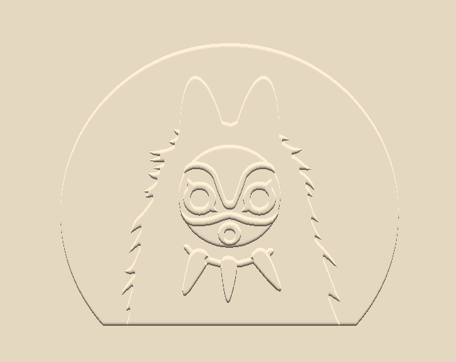

# Virtual Embossing

This software uses a raster image of a layered vector drawing to simulate what it would look like if those layers were cut out and used to emboss a piece of paper. This is a pretty niche concept, so the code is very specific to one application: [my friend creates paper crafts](https://www.youtube.com/channel/UCPDpOa_C5eoZyRvEaHQ8xIg) so I made it to help speed up his design process. You can read my blog about this project [here](http://zackpi.com/hobby/2019-06-03-emboss.html).

## How to use

Create a vector drawing of your choosing that looks like this, and clearly choose the colors of the layers based on the saturation channel to indicate the depth of the embossing:


Then take a raster image of it, using some desktop screenshot software (the easiest method in my opinion) or export the region of the design window to a .png or .jpg in your vector software. Running the code is easy; just save your image in this directory with the python script and open the command line and type this:

```
python emboss.py [image]
```

About a second later (depending on the size of the image you chose) the output image should pop up. You can either hit **Enter** or **Esc** to close the window, or **S** to save the image as `output.png` in the same directory. Here is some sample output for the image above:



## More sample output

#### Virtual embossings



#### Actual embossings


